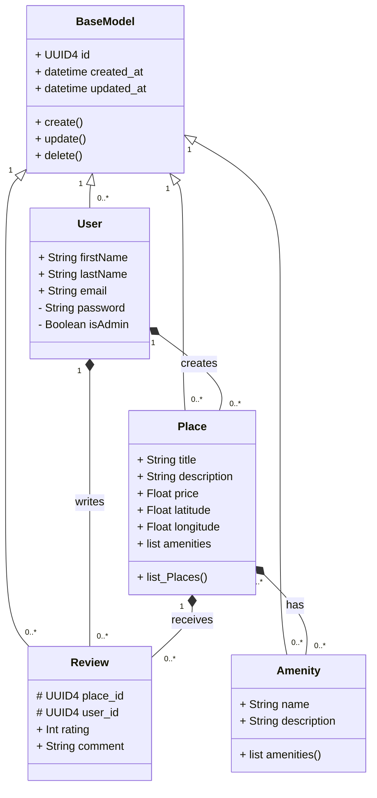

```mermaid
classDiagram
    class BaseModel {
        + UUID4 id
        + datetime created_at
        + datetime updated_at
        + create()
        + update()
        + delete()
        }

    class User {
        + String firstName
        + String lastName
        + String email
        - String password
        - Boolean isAdmin
        }

    class Place {
        + String title
        + String description
        + Float price
        + Float latitude
        + Float longitude
        + list amenities
        + list_Places()
        }

    class Review {
        # UUID4 place_id
        # UUID4 user_id
        + Int rating
        + String comment
        }

    class Amenity {
        + String name
        + String description
        + list amenities()
        }

    BaseModel "1" <|-- "0..*" User
    BaseModel "1" <|-- "0..*" Place
    BaseModel "1" <|-- "0..*" Review
    BaseModel "1" <|-- "0..*" Amenity
    User "1" *-- "0..*" Place : creates
    User "1"  *-- "0..*" Review : writes
    Place "1" *-- "0..*" Review : receives
    Place "0..*" *-- "0..*" Amenity : has

```