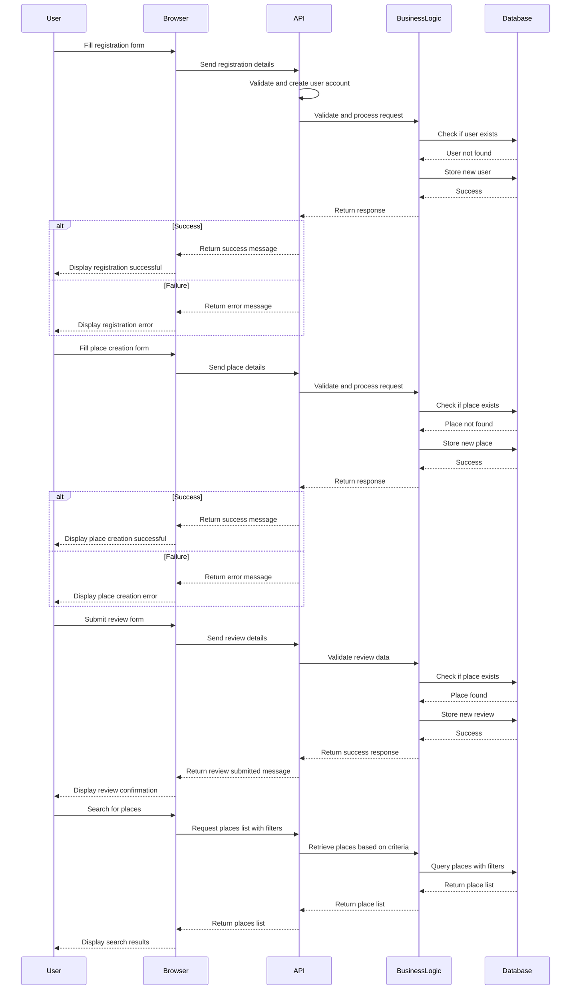

```mermaid
sequenceDiagram
    participant User
    participant Browser
    participant API
    participant BusinessLogic
    participant Database

    # User Registration: A user signs up for a new account.

    User->>Browser: Fill registration form
    Browser->>API: Send registration details
    API->>API: Validate and create user account
    API->>BusinessLogic: Validate and process request
    BusinessLogic->>Database: Check if user exists
    Database-->>BusinessLogic: User not found
    BusinessLogic->>Database: Store new user
    Database-->>BusinessLogic: Success
    BusinessLogic-->>API: Return response
    alt Success
        API-->>Browser: Return success message
        Browser-->>User: Display registration successful
    else Failure
        API-->>Browser: Return error message
        Browser-->>User: Display registration error
    end

    # Place Creation: A user creates a new place listing.

    User->>Browser: Fill place creation form
    Browser->>API: Send place details
    API->>BusinessLogic: Validate and process request
    BusinessLogic->>Database: Check if place exists
    Database-->>BusinessLogic: Place not found
    BusinessLogic->>Database: Store new place
    Database-->>BusinessLogic: Success
    BusinessLogic-->>API: Return response
    alt Success
        API-->>Browser: Return success message
        Browser-->>User: Display place creation successful
    else Failure
        API-->>Browser: Return error message
        Browser-->>User: Display place creation error
    end

    # Review Submission: A user submits a review for a place.

    User->>Browser: Submit review form
    Browser->>API: Send review details
    API->>BusinessLogic: Validate review data
    BusinessLogic->>Database: Check if place exists
    Database-->>BusinessLogic: Place found
    BusinessLogic->>Database: Store new review
    Database-->>BusinessLogic: Success
    BusinessLogic-->>API: Return success response
    API-->>Browser: Return review submitted message
    Browser-->>User: Display review confirmation

    # Fetching a List of Places: A user requests a list of places based on certain criteria.

    User->>Browser: Search for places
    Browser->>API: Request places list with filters
    API->>BusinessLogic: Retrieve places based on criteria
    BusinessLogic->>Database: Query places with filters
    Database-->>BusinessLogic: Return place list
    BusinessLogic-->>API: Return place list
    API-->>Browser: Return places list
    Browser-->>User: Display search results
```
