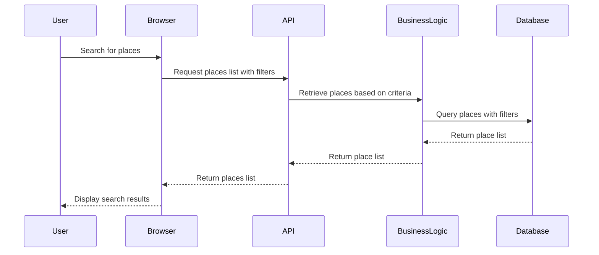

```mermaid
sequenceDiagram
    participant User
    participant Browser
    participant API
    participant BusinessLogic
    participant Database

    # Fetching a List of Places: A user requests a list of places based on certain criteria.

    User->>Browser: Search for places
    Browser->>API: Request places list with filters
    API->>BusinessLogic: Retrieve places based on criteria
    BusinessLogic->>Database: Query places with filters
    Database-->>BusinessLogic: Return place list
    BusinessLogic-->>API: Return place list
    API-->>Browser: Return places list
    Browser-->>User: Display search results
```
