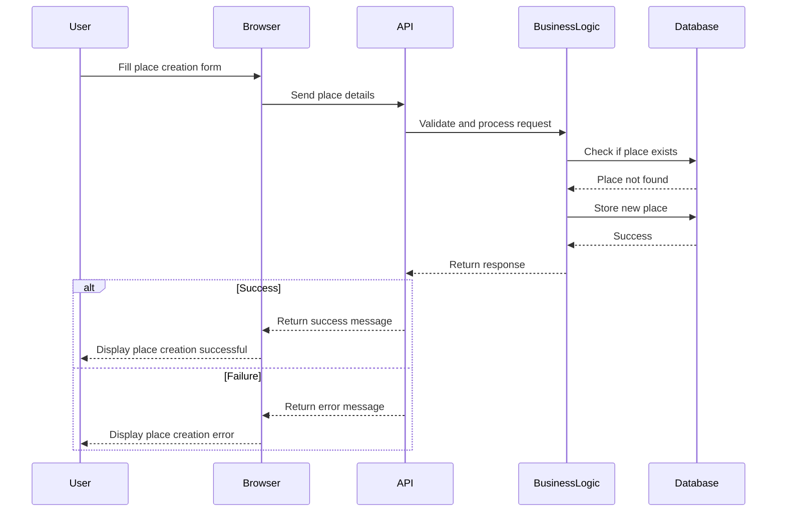

```mermaid
sequenceDiagram
    participant User
    participant Browser
    participant API
    participant BusinessLogic
    participant Database

    # Place Creation: A user creates a new place listing.

    User->>Browser: Fill place creation form
    Browser->>API: Send place details
    API->>BusinessLogic: Validate and process request
    BusinessLogic->>Database: Check if place exists
    Database-->>BusinessLogic: Place not found
    BusinessLogic->>Database: Store new place
    Database-->>BusinessLogic: Success
    BusinessLogic-->>API: Return response
    alt Success
        API-->>Browser: Return success message
        Browser-->>User: Display place creation successful
    else Failure
        API-->>Browser: Return error message
        Browser-->>User: Display place creation error
    end
```
