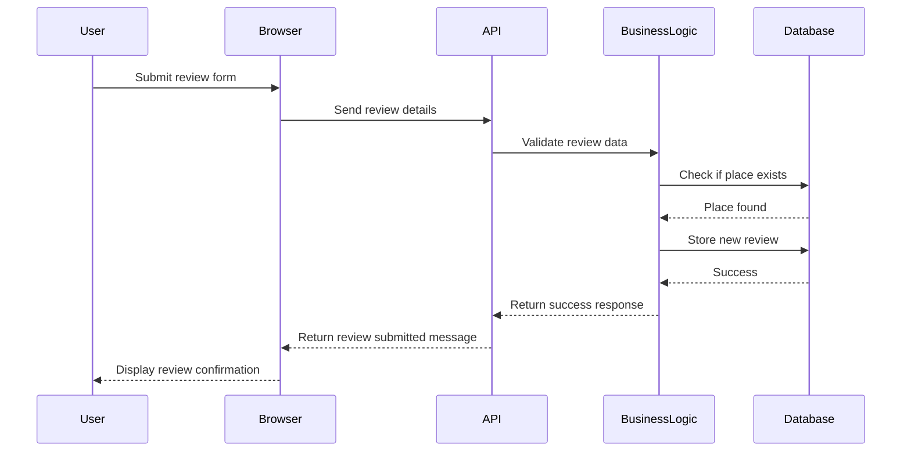

```mermaid
sequenceDiagram
    participant User
    participant Browser
    participant API
    participant BusinessLogic
    participant Database

    # Review Submission: A user submits a review for a place.

    User->>Browser: Submit review form
    Browser->>API: Send review details
    API->>BusinessLogic: Validate review data
    BusinessLogic->>Database: Check if place exists
    Database-->>BusinessLogic: Place found
    BusinessLogic->>Database: Store new review
    Database-->>BusinessLogic: Success
    BusinessLogic-->>API: Return success response
    API-->>Browser: Return review submitted message
    Browser-->>User: Display review confirmation
```
