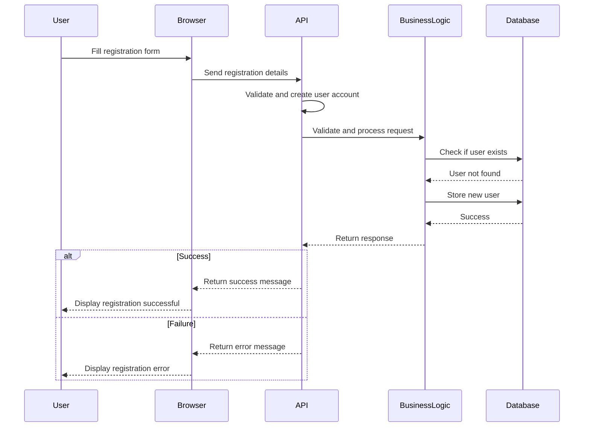

```mermaid
sequenceDiagram
    participant User
    participant Browser
    participant API
    participant BusinessLogic
    participant Database

    # User Registration: A user signs up for a new account.

    User->>Browser: Fill registration form
    Browser->>API: Send registration details
    API->>API: Validate and create user account
    API->>BusinessLogic: Validate and process request
    BusinessLogic->>Database: Check if user exists
    Database-->>BusinessLogic: User not found
    BusinessLogic->>Database: Store new user
    Database-->>BusinessLogic: Success
    BusinessLogic-->>API: Return response
    alt Success
        API-->>Browser: Return success message
        Browser-->>User: Display registration successful
    else Failure
        API-->>Browser: Return error message
        Browser-->>User: Display registration error
    end
```
