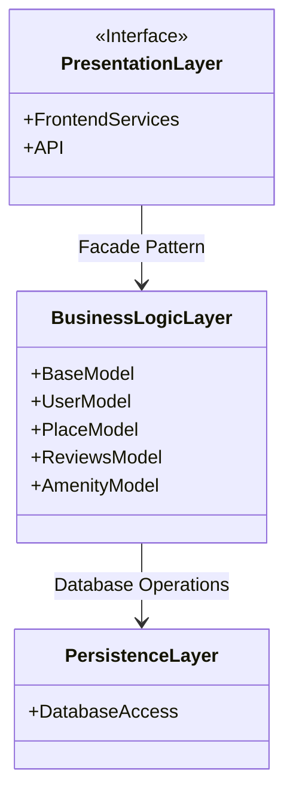
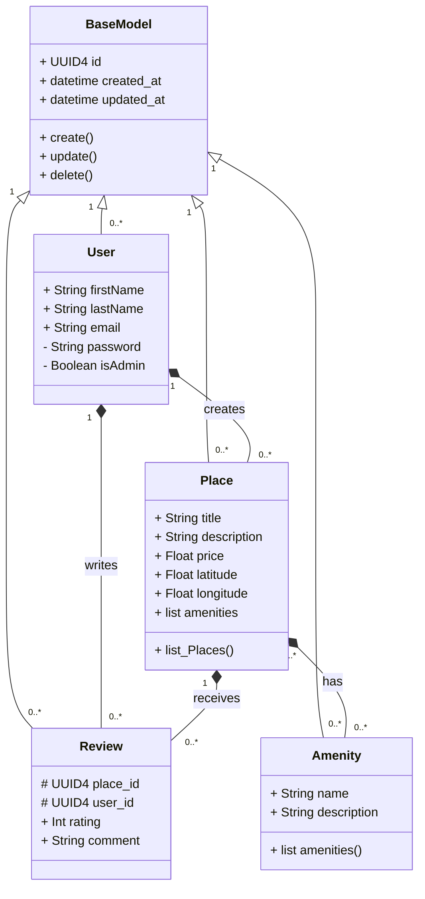
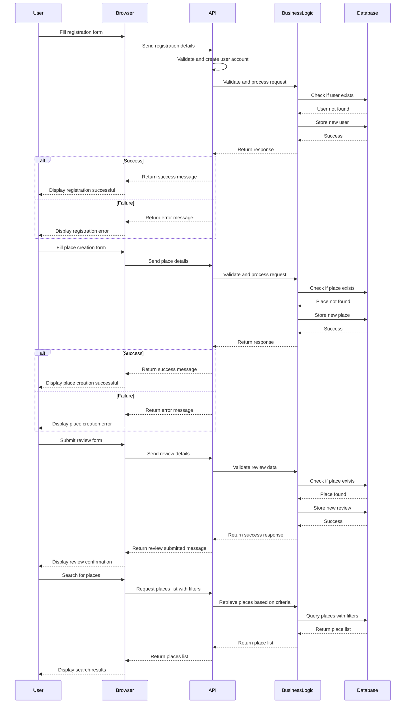
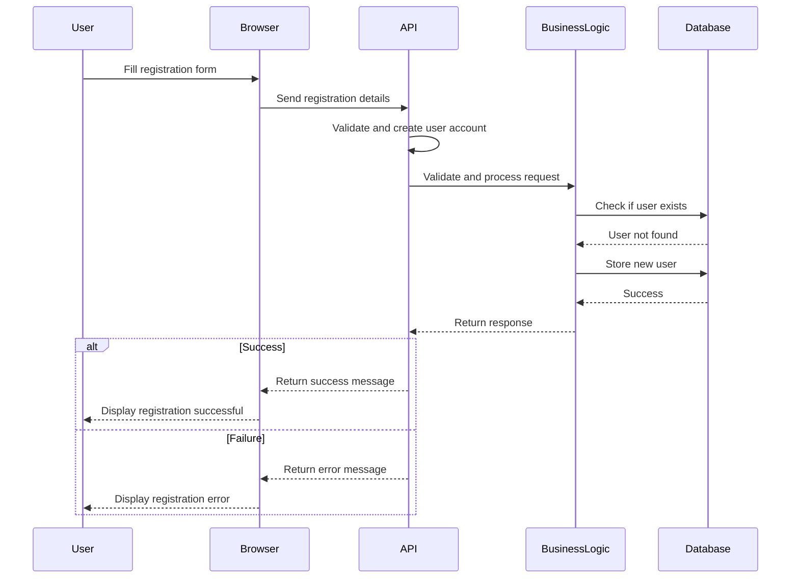
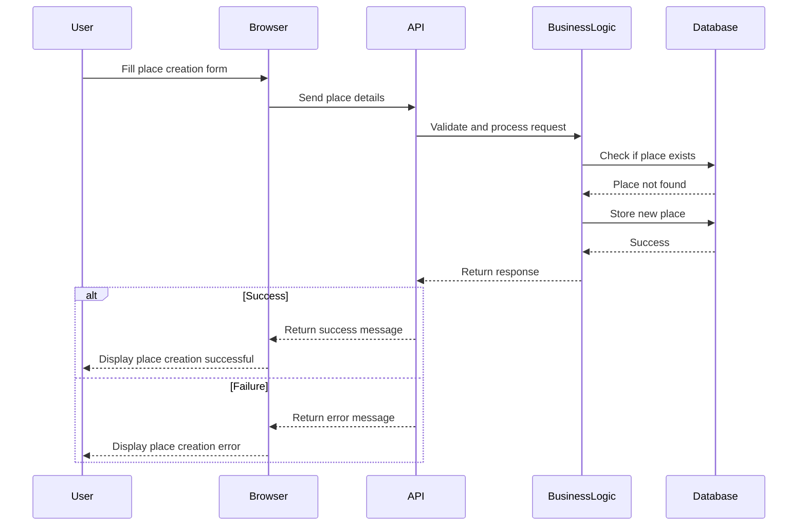
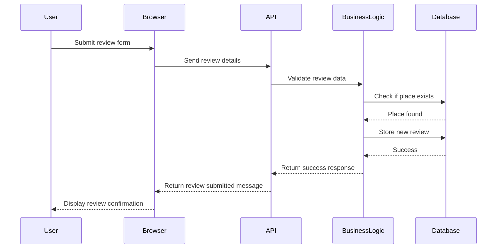
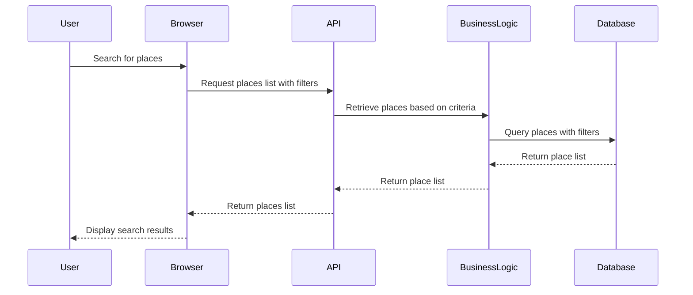

# HBnB Evolution - Technical Documentation

## 1. Context and Objective

This document serves as the foundation for the development of the HBnB Evolution application. It provides a comprehensive overview of the system’s architecture, business logic design, and interactions. The goal is to establish a well-structured and maintainable system before implementation.

## 2. Problem Description

HBnB Evolution is a simplified version of an AirBnB-like application that allows users to:

- **User Management:** Register, update profiles, and be classified as regular users or administrators.
- **Place Management:** List, modify, and delete properties with details such as name, description, price, and location.
- **Review Management:** Submit, update, and delete reviews including ratings and comments for places.
- **Amenity Management:** Manage amenities that can be associated with places.

## 3. Business Rules and Requirements

### User Entity

- Attributes: First name, last name, email, password.
- Identified as an administrator using a boolean attribute.
- Operations: Create, update, delete.

### Place Entity

- Attributes: Title, description, price, latitude, longitude.
- Associated with an owner (User entity).
- Can have a list of amenities.
- Operations: Create, update, delete, list.

### Review Entity

- Attributes: Rating, comment.
- Associated with a specific place and user.
- Operations: Create, update, delete, list by place.

### Amenity Entity

- Attributes: Name, description.
- Operations: Create, update, delete, list.

### Common Requirements

- Unique identification using UUID4.
- Audit fields: Creation and update timestamps.

## 4. Architecture and Layers

The application follows a **three-layer architecture**:

- **Presentation Layer:** Provides API services for user interaction.
- **Business Logic Layer:** Contains the core models and rules.
- **Persistence Layer:** Handles data storage and retrieval.

### High-Level Package Diagram

## 5. Detailed Class Diagram for Business Logic Layer

### Key Entities and Relationships

- **User** → Creates **Places**, submits **Reviews**.
- **Place** → Associated with an **Owner (User)**, contains **Amenities**, receives **Reviews**.
- **Review** → Associated with a **User** and a **Place**.
- **Amenity** → Linked to **Places**.

### Class Diagram

## 6. Sequence Diagrams for API Calls

### User Registration

### Place Creation

### Review Submission

### Fetching Places

## 7. Documentation Compilation

This document consolidates all diagrams and explanations to guide the next phase: implementation.

## 8. Conclusion

This technical documentation outlines the core design of the HBnB Evolution application, ensuring clarity in architecture, business logic, and system interactions before moving to the implementation phase.

