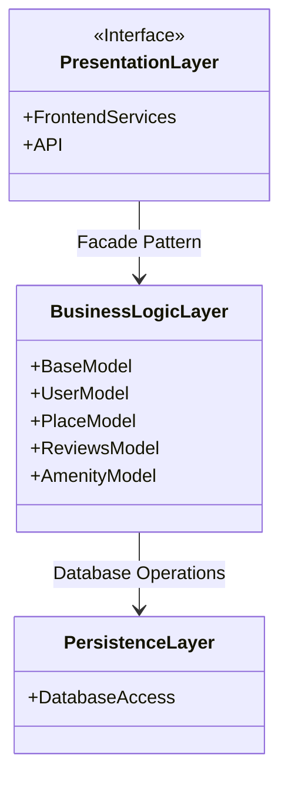
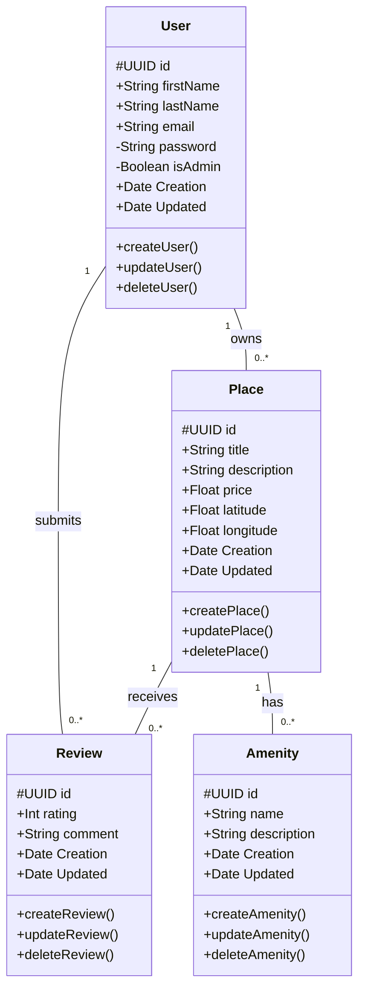
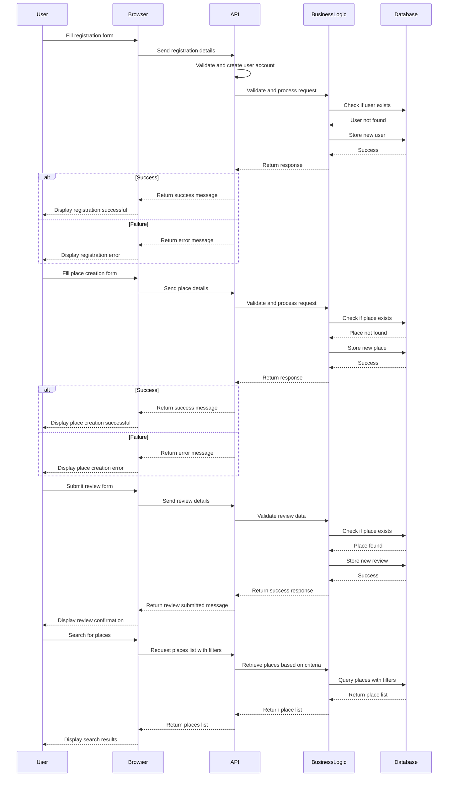

# 🏠 HBnB Project   

## Project Objective: HBNB Evolution - PART 1

The **HBNB Evolution** project is an advanced step in the development of a **fully functional AirBnB clone**, incorporating more robust and scalable features. The goal is to transition from a simple command-line interface to a fully interactive **web application**, integrating a **storage engine, a RESTful API, and a front-end interface**.

This project emphasizes **software architecture, database management, and web development**, allowing users to **create, update, delete, and manage places, users, reviews, and amenities**. It also introduces concepts of **data persistence**, improving efficiency with different storage options (file storage and database storage).

### Key Objectives:
- **Enhancing user experience** with a web-based UI.
- **Implementing a RESTful API** to facilitate communication between the front-end and back-end.
- **Optimizing data management** with an improved storage system.
- **Ensuring scalability and maintainability** through modular development and best coding practices.

By the end of this project, the system should be capable of handling real-world scenarios for an AirBnB-like platform, demonstrating a comprehensive understanding of full-stack development.

### 📍 Project Scope  
**HBnB Evolution** is a simplified application inspired by Airbnb that allows users to:  
✔️ Register  
✔️ Add properties  
✔️ Associate amenities   
✔️ Submit reviews  

---
## Business Rules and Requirements

### User Entity
- Each user has a **first name**, **last name**, **email**, and **password**.
- Users can be identified as **administrators** through a boolean attribute.
- Users should be able to **register**, **update** their profile information, and be **deleted**.

### Place Entity
- Each place has a **title**, **description**, **price**, **latitude**, and **longitude**.
- Places are associated with the **user** who created them (owner).
- Places can have a **list of amenities**.
- Places can be **created**, **updated**, **deleted**, and **listed**.

### Review Entity
- Each review is associated with a **specific place** and **user**, and includes a **rating** and **comment**.
- Reviews can be **created**, **updated**, **deleted**, and **listed by place**.

### Amenity Entity
- Each amenity has a **name** and **description**.
- Amenities can be **created**, **updated**, **deleted**, and **listed**.

### General Rules
- Each object should be uniquely identified by an **ID**.
- For audit reasons, the **creation** and **update datetime** should be recorded for all entities.

## General Architecture  

### **Package Diagram**  
The architecture follows a **layered model**, integrating the **facade pattern** to simplify interactions between components.  

**The 3 main layers**:  

1️⃣ **Presentation Layer**  
- Manages the user interface and interactions.  
- Receives requests and returns responses after processing.  

2️⃣ **Business Logic Layer**  
- Contains key models (**User, Place, Review, Amenity**).  
- Implements business rules and orchestrates operations.  
- Acts as a **facade** for communication with the persistence layer.  

3️⃣ **Persistence Layer**  
- Manages the database and CRUD operations.  
- Structures data to ensure integrity and consistency.  

## 🛠️ Business Logic Layer  

### 📌 **Class Diagram**  
The core of the application relies on several **key entities**:  

### High-Level Architecture - classDiagram

### 🔗 **Entity Relationships**  
✔️ **A user** can own multiple **places** and leave multiple **reviews**.  
✔️ **A place** can receive multiple **reviews** and be associated with multiple **amenities**.  

The architecture of the business logic layer ensures **consistency, scalability, and modularity**.  

---
## 🔄 API Interaction Flow  

### 📊 **Sequence Diagrams for API calls**  

#### 📝 **1. User Registration**  
1️⃣ The user sends their information (**name, email, password**) to the **Presentation Layer**.  
2️⃣ It validates and forwards them to the **Business Logic Layer**.  
3️⃣ After validation, the data is stored via the **Persistence Layer**.  
4️⃣ A success or failure response is returned.  

#### 🏡 **2. Place Creation**  
1️⃣ The user submits a creation request (**title, description, etc.**).  
2️⃣ The **Presentation Layer** forwards the request to the **Business Logic Layer**.  
3️⃣ After validation, the data is inserted via the **Persistence Layer**.  
4️⃣ A confirmation is returned.  

#### ⭐ **3. Review Submission**  
1️⃣ The user wants to leave a review for a place.  
2️⃣ The **Presentation Layer** sends the details (**rating, comment, etc.**) to the **Business Logic Layer**.  
3️⃣ The review is stored via the **Persistence Layer**, and a response is returned.  

#### 📍 **4. Retrieving Available Places**  
1️⃣ The user requests the list of available places.  
2️⃣ The **Presentation Layer** queries the **Business Logic Layer**, which consults the **Persistence Layer**.  
3️⃣ The results are returned and displayed to the user.  

---
